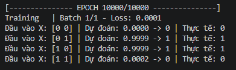
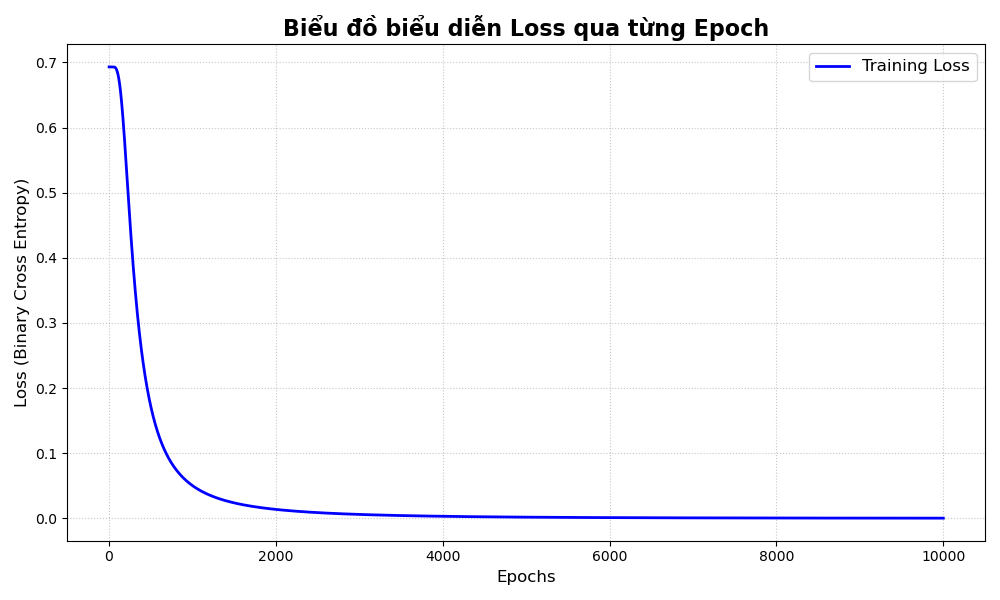

# NumPy-Neural-Net: Building Neural Networks using NumPy

NumPy-Neural_Net is a Python project for building artificial neural networks using NumPy.

# Activations: The activation functions implemented in the project and the code to use them.

- **Activations**: Linear, ReLU, leaky-ReLU, Sigmoid, Softmax
- **How to use**:
  - Normal: `A = linear(X) `
  - Devirative: `dA = linear(X, derivative = True)`

# Implement a neural network

The following code implements all the steps to build and train a neural network.
(what the example code does is try to solve the XOR logic gate problem.)

### Build

```python
import numpy as np
import matplotlib.pyplot as plt

from neural_network import NeuralNetwork

from modules.base import Layer
from modules.activation_layer import Activation
from modules.dense_layer import Dense
from modules.batchnorm import BatchNorm
from modules.dropout import Dropout

X_train = np.array([
        [0, 0],
        [0, 1],
        [1, 0],
        [1, 1]
    ])

Y_train = np.array([
    [0],
    [1],
    [1],
    [0]
])

nn = NeuralNetwork(input_dim=X_train.shape)

nn.add(Dense(number_neurons=4, activation="linear", init_type="random", regularizer=None, freeze=False))
nn.add(Activation(activation="sigmoid"))
nn.add(Dense(number_neurons=1, activation="linear", init_type="random", regularizer=None, freeze=False))
nn.add(Activation(activation="sigmoid"))
```

### Train

```python
training_set = (X_train, Y_train)

training_costs, validation_costs, learning_rates = nn.fit(
    training_set=training_set,
    validation_set=None,
    num_epochs=10000,
    cost_function="binary_cross_entropy",
    optimizer="adam",
    learning_rate=0.006,
    mini_batch_size=4,
    verbose=True
)
```

### Predict

```python
predictions = nn.predict(X_train)
```

### Result



